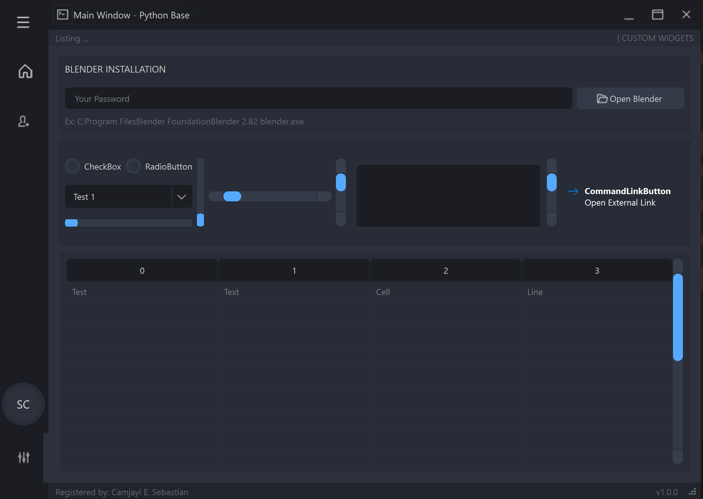
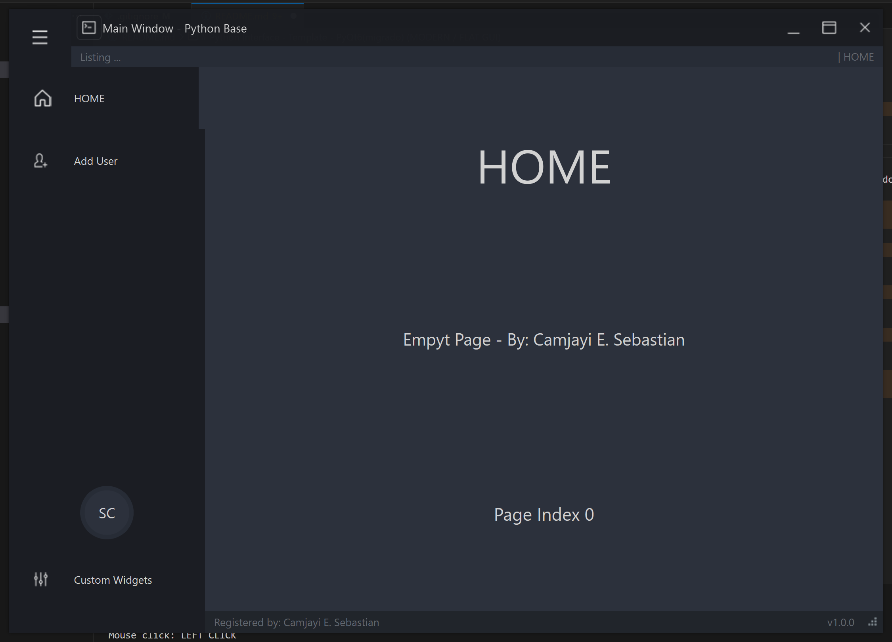
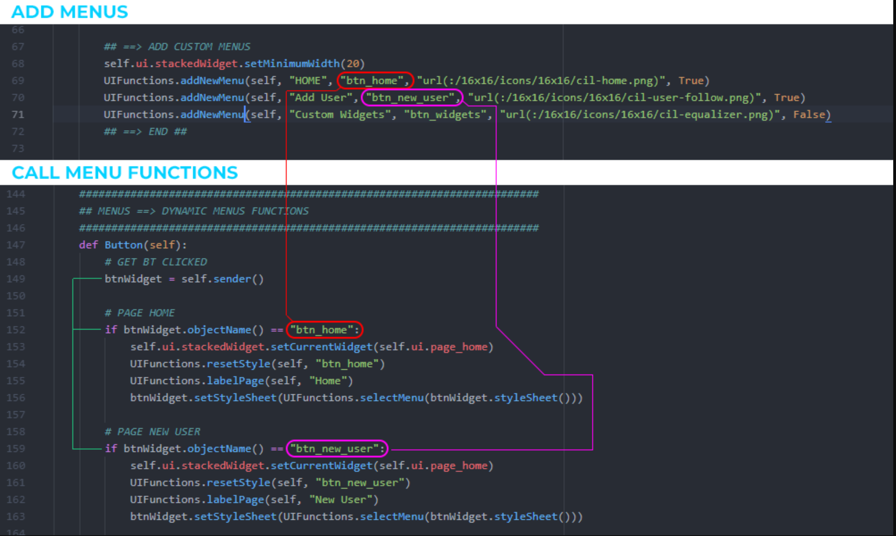

# netfloxpydesk (MODERN / FLAT GUI)

> **Nota**: Este proyecto ha sido migrado y funciona utilizando PyQt6 (**pip install PyQt6**).





Proyecto **netfloxpydesk** creado utilizando Python, Qt Designer y PyQt6.
Es una interfaz gráfica moderna de escritorio para la gestión del sistema. 

Este proyecto funciona muy bien en Windows; sin embargo, en Linux y macOS puede haber algunos detalles con el tamaño de las fuentes y la barra de título personalizada.

## REQUISITOS

Para instalar las dependencias necesarias en tu entorno de desarrollo, ejecuta:

```sh
pip install PyQt6
```

## CÓMO EJECUTAR

Para iniciar la aplicación, ejecuta el archivo principal desde la terminal:

```sh
python main.py
```

## AGREGAR MENÚS


